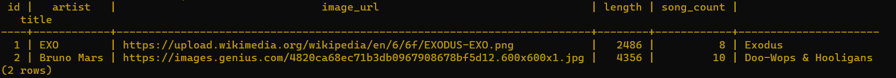

# Albums : 

 

## When the user vists the website, the pages that will be available are the following : 

 

1- The album page, it contains a set of albums with some information like : **/albums**

  - The title of the album.

  - The cover of the album. 

  - The artist.

  - Number of songs.

  - The length of the album (In seconds).

 

2- Capitalized page : **/capitalize/{word}**

  - This page takes the **{word}** from the endpoint that has been added by the user and returns it in the page with capital letters.

 

3- A Form that allows the user to add a new album with the same given information. 

4- A Form that allows the user to add a new song belongs to one of the added albums.

To make this application works => 

- application.properties file : 

 

- build.gradle file : 

The database, tables and firlds => The relation between the album table and song is one-to-many.

 

## Endpoints : 

- **("/")** => Home page. 

- **(/capitalize/{word})** => Convert the given word to its uppercase. 

- **(/albums)** => Shows all of the albums.

- **(/addAlbum)** => Allows the user to add a new album.

- **(/songs)** => Shows all of the songs.

- **(/addSong)** => Allows the user to add a new song.

- **(/song/{id})** => Shows the song based on its id that stoed in the DB.

- **(/album/{id})** => Shows the album based on its id that stoed in the DB.